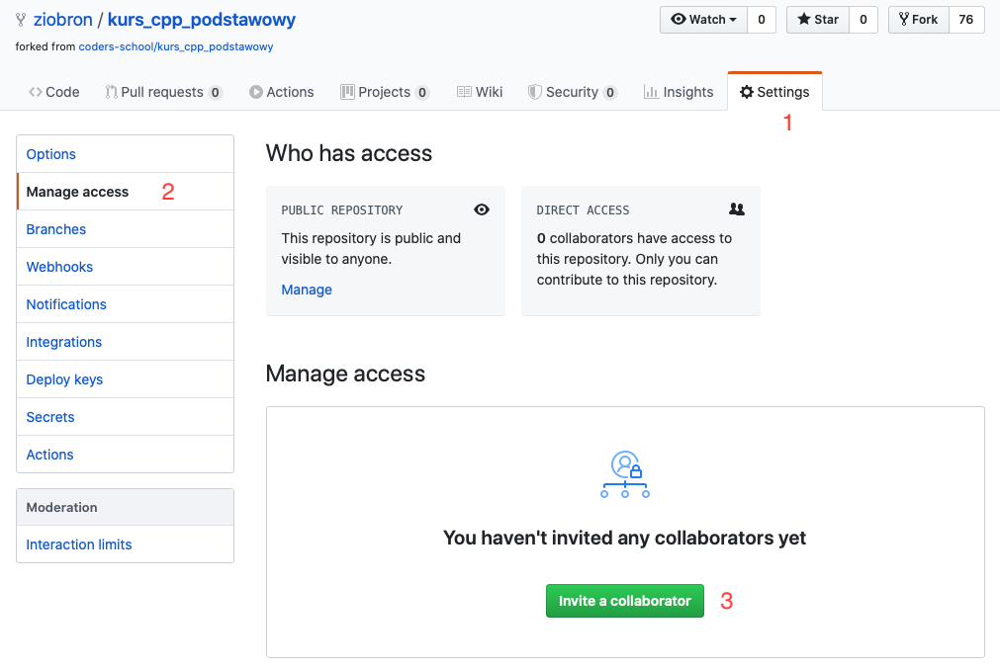

<!-- .slide: data-background="#111111" -->

# Podstawy C++

## Dostarczenie zadań

___
<!-- .slide: style="font-size: 0.75em" -->

### Synchronizacja forka

Zanim w ogóle rozpoczniesz pracę musisz zsynchronizować to co masz na swoim forku z tym, co zostało w międzyczasie dostarczone do repo coders-school/cpp-fundamentals. Nie możesz zrobić drugiego forka. GitHub na to nie pozwala.

Wykonaj następujące instrukcje

1. Wejdź do katalogu z forkiem
2. Przełącz się na gałąź `master`. Upewnij się, że nie masz żadnych lokalnych zmian.
3. Dodaj nowe repozytorium zdalne (jeśli jeszcze go nie masz) - `git remote add cs https://github.com/coders-school/cpp-fundamentals.git`
4. Ściągnij wszystkie zmiany z repo coder-school/cpp-fundamentals - `git pull cs`
5. Sprawdź, czy masz gałęzie `password-check` oraz `vector-of-shared-ptrs` - `git branch -a`
6. Wrzuć wszystkie nowe gałęzie oraz `master` do swojego forka na Githubie. W tym celu przełączaj się na każdą z tych gałęzi i wykonaj `git push origin HEAD`

___

### Bonus za pracę w parach

Za dostarczenie zadań wspólnie z kimś innym dostaniesz dodatkowo 1 punkt (na osobę). W PR powinny być widoczne commity obu osób oraz musi być on odpowiednio opisany, np:

Title: `Homework Podstawy C++ password-check`

Description: `Authors: @github_nick1, @github_nick2  \n Some additional info`

**Najważniejsze jest, aby w opisie wymienić po znaku @ wszystkich autorów**. Na podstawie tej listy przyznawane są punkty odpowiednim osobom.

Najprościej będzie, gdy druga osoba zrobi clone forka repozytorium tej pierwszej, a ta pierwsza doda uprawnienia do zapisu dla tej drugiej.

Alternatywnie, można też dodać nowe zdalne repozytorium w już wcześniej sklonowanym swoim forku za pomocą `git remote add NAME ADDRESS`. Ale to zapewne spowoduje konflikty na gałęziach z już zgłoszonymi zadaniami, jeśli zsynchronizujesz wszystko.

___

### Dodawanie współpracownika do repo na GitHubie

___
<!-- .slide: style="font-size: 0.8em" -->

### Instrukcja dla osoby korzystającej z forka współpracownika

1. Poczekaj aż współpracownik zsynchronizuje swój fork na GitHubie.
2. Wybierz wariant:
   1. Zrób `git clone adres_repo_współpracownika` i na nim pracuj (łatwiejszy)
   2. Do swojego pobranego wcześniej swojego forka dodaj adres repo współpracownika `git remote add NICK ADDRESS` i ściągnij z niego zmiany - `git fetch NICK`
3. Przełącz się na gałąź dla odpowiedniej pracy domowej - `git checkout TASK`
4. Skompiluj i zbuduj kod, podzielcie się robotą, zaimplementujcie rozwiązanie.
5. Wysyłaj zmiany na GH współpracownika:
   1. `git push origin TASK` lub
   2. `git push NICK TASK` (w zależności od wariantu z pkt. 2)
6. Współpracownik zgłosi PR, Ty nic nie musisz klikać :)

Jeśli chcesz mieć też te zadania w swoim forku, musisz do niego wysłać zmiany. Robisz to synchronizując repozytoria za pomocą komend `git remote add NICK ADDRESS` oraz `git push NICK TASK`.

W razie problemów zawsze możesz zapytać na Discordzie. Możesz też przejść na pracę samodzielną. Powodzenia! 🙂
