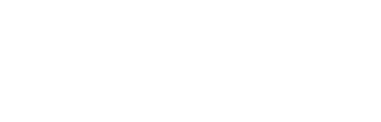

<!-- .slide: data-background="#111111" -->

# C++ basics

## Arrays

<a href="https://coders.school">
    
</a>

___

## Introduction to arrays

# 🚃🚃🚃🚃🚃🚃🚃🚃🚃🚃

* <!-- .element: class="fragment fade-in" --> Arrays can be treated like wagons in a train
* <!-- .element: class="fragment fade-in" --> Arranged one by one and connected to each other
* <!-- .element: class="fragment fade-in" --> They can hold different types like human, coal, etc.
* <!-- .element: class="fragment fade-in" --> We can write 10 coal wagons as <code>Coal tab[10]</code> - it means that we create an array that stores 10 elements of type <code>Coal</code>.

___



* In C++, the array is in one continuous area in memory and is inseparable (its elements cannot be removed)
* All items are of the same type
* The array is always indexed from 0
* `tab[0]` - the first element of the array `tab`
* `tab[9]` - the last element of a 10-element array `tab`

___

## Example of array modification

```cpp
int tab[10];
tab[0] = 1;
tab[1] = 2;
// ...
tab[9] = 10;
```

This could be done better with a loop. <!-- .element: class="fragment fade-in" -->

___

### `operator[]`

We refer to an array element with `operator[]`. We must remember to always refer to an existing array element. Otherwise the program will have undefined behavior as we will try to access memory that is not in the array. It's called garbage. At best, the operating system will detect it and we'll get a <span class="fragment highlight-red">**crash** (segmentation fault)</span>. At worst, we will work on some incorrect random data. The effects can be very serious (<span class="fragment highlight-red">space shuttle crashes</span>, <span class="fragment highlight-red">irradiation from medical apparatus</span>).

```cpp
int tab[10];
tab[10] = 42;  // !!! undefined behavior (UB)
```
<!-- .element: class="fragment fade-in" -->

___

## Exercise

Modify the program so that it fills the array with the following odd numbers: 1, 3, 5, 7, ... [Download the exercise][homework]

```cpp
#include <iostream>

constexpr size_t tab_size = 100;

int main() {
    int tab[tab_size];

    for (size_t i = 0; i < tab_size; ++i) {
        tab[i] = i;
    }

    for (size_t i = 0; i < tab_size; ++i) {
        std::cout << tab[i] << "\n";
    }

    return 0;
}
```

[homework]: https://github.com/coders-school/cpp-fundamentals/blob/master/module1/task4.cpp
